# 2000 palettes
2000 palettes for MATLAB
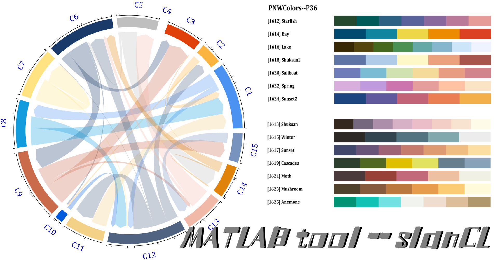
## Acknowledgement & Source:
All palettes come from the following 55 color packages:
```
'awtools'/'basetheme'/'beyonce'/'calecopal'/'colorBlindness'/'colorblindr'
'colRoz'/'dichromat'/'DresdenColor'/'dutchmasters'/'fishualize'/'futurevisions'
'ggpomological'/'ggprism'/'ggsci'/'ggthemes'/'ggthemr'/'ghibli'/'grDevices'
'IslamicArt'/'jcolors'/'khroma'/'LaCroixColoR'/'lisa'/'Manu'/'MapPalettes'
'miscpalettes'/'nationalparkcolors'/'nbapalettes'/'NineteenEightyR'/'nord'
'ochRe'/'palettesForR'/'palettetown'/'pals'/'PNWColors'/'Polychrome'
'rcartocolor'/'RColorBrewer'/'Redmonder'/'rockthemes'/'RSkittleBrewer'
'rtist'/'soilpalettes'/'suffrager'/'tayloRswift'/'tidyquant'/'trekcolors'
'tvthemes'/'unikn'/'vapeplot'/'vapoRwave'/'werpals'/'wesanderson'/'yarrr'
```
## 基本使用(Basic use)
以下先说明代码咋用，最基础的用法就是：\
The following first explains how to use the code. The most basic usage is:
```matlab
slanCL(n)
```
就是选择slanCL包的第n套配色：\
Is to choose the nth set of colors for the slanCL package:
```matlab
CList=slanCL(617)
% CList =
%     0.3059    0.4745    0.6549
%     0.9490    0.5569    0.1686
%     0.8824    0.3412    0.3490
%     0.4627    0.7176    0.6980
%     0.3490    0.6314    0.3098
%     0.9294    0.7882    0.2824
%     0.6902    0.4784    0.6314
%     1.0000    0.6157    0.6549
%     0.6118    0.4588    0.3725
%     0.7294    0.6902    0.6745
```

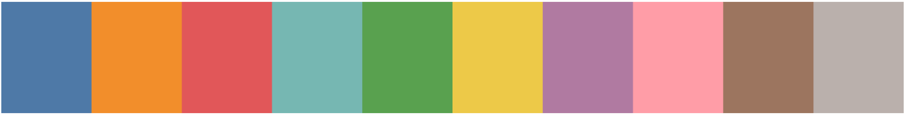

第二种用法有俩参数：\
The second usage has two parameters:
```matlab
slanCL(n,Ind)
```
Ind可以是一个数值，也可以是一个向量：\
Ind can be a numeric value or a vector:
```matlab
CList=slanCL(617,[1,3,5,7,9])
% CList = 
%     0.3059    0.4745    0.6549
%     0.8824    0.3412    0.3490
%     0.3490    0.6314    0.3098
%     0.6902    0.4784    0.6314
%     0.6118    0.4588    0.3725
```

若是向量中的数值大于配色所含颜色数，依旧能取到颜色，不过颜色亮度变为前一轮颜色90%:\
If the value in the vector is greater than the number of colors included in the color matching, the color can still be obtained, but the color brightness changes to 90% of the previous round of colors:
```matlab
CList=slanCL(617,1:80);
```
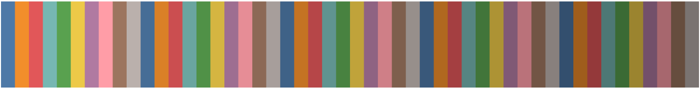
可以看到数值越大颜色越暗：\
You can see that the larger the value, the darker the color:

## 配色筛选器(Color Filter)
#### 选择来源库：
Select a source package:
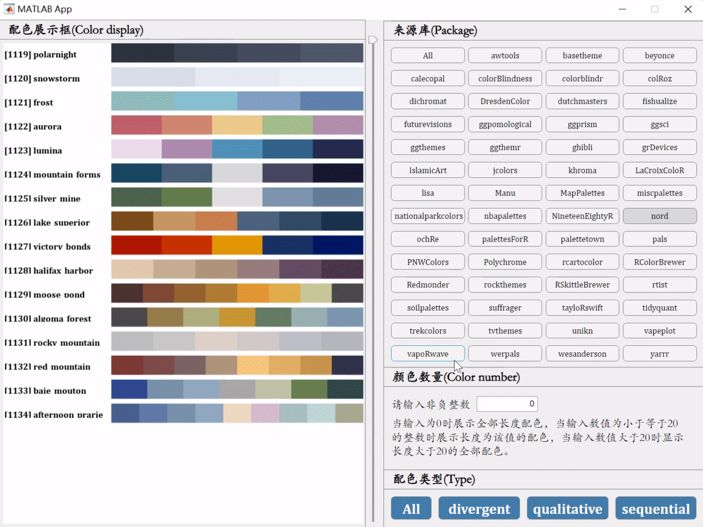
#### 类型选择：
Select Type:
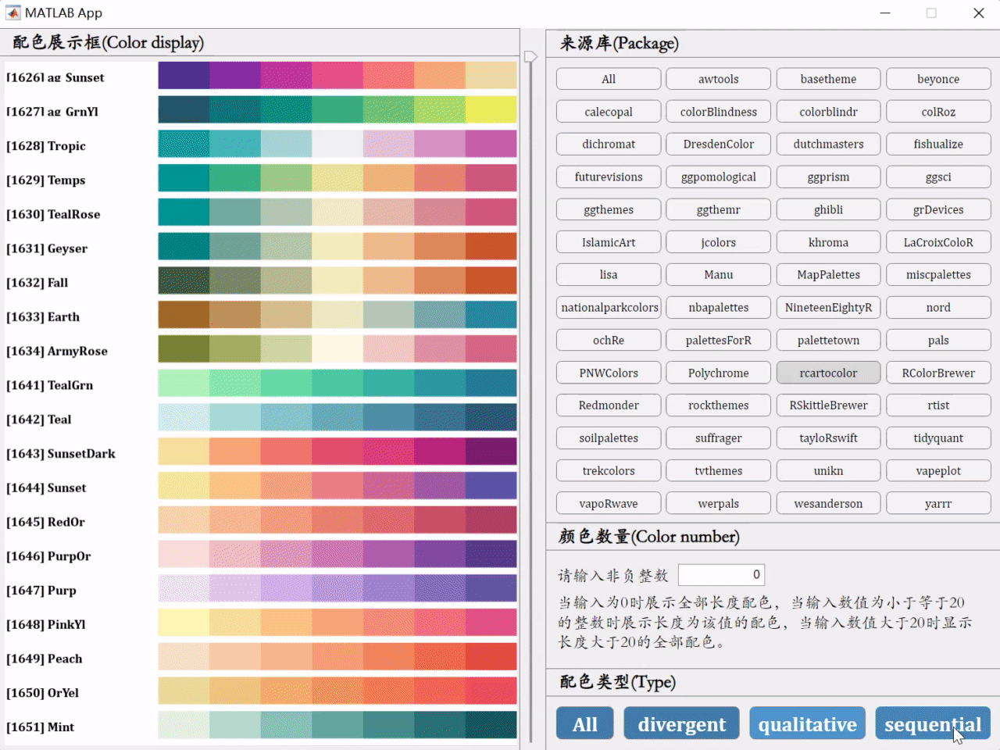
#### 颜色数量选择：
Select the number of colors：
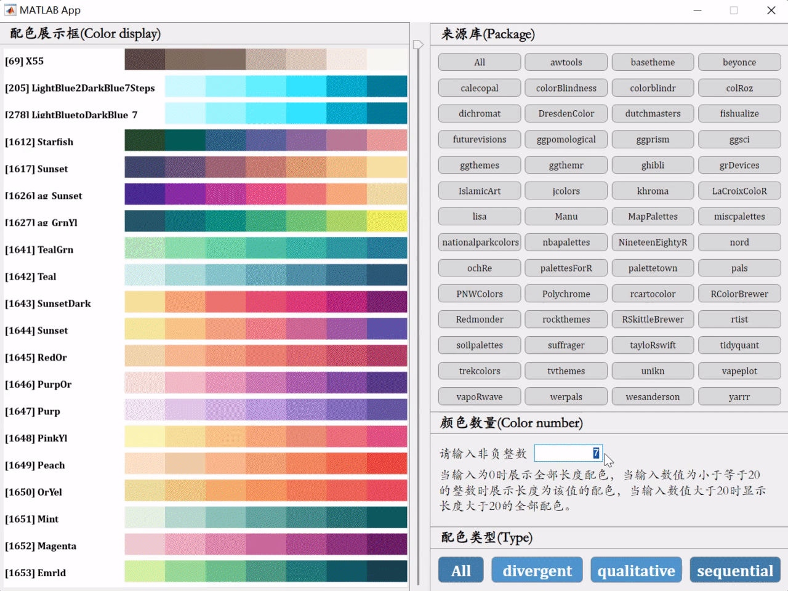
#### 拖动滑动条：
Drag the slider：
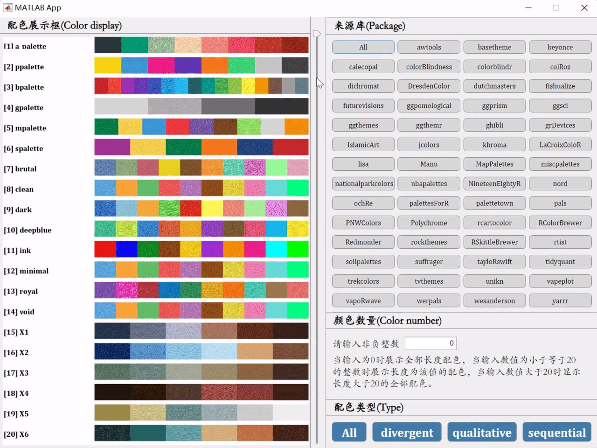

## 一些使用配色的例子(Some examples of using color matching)
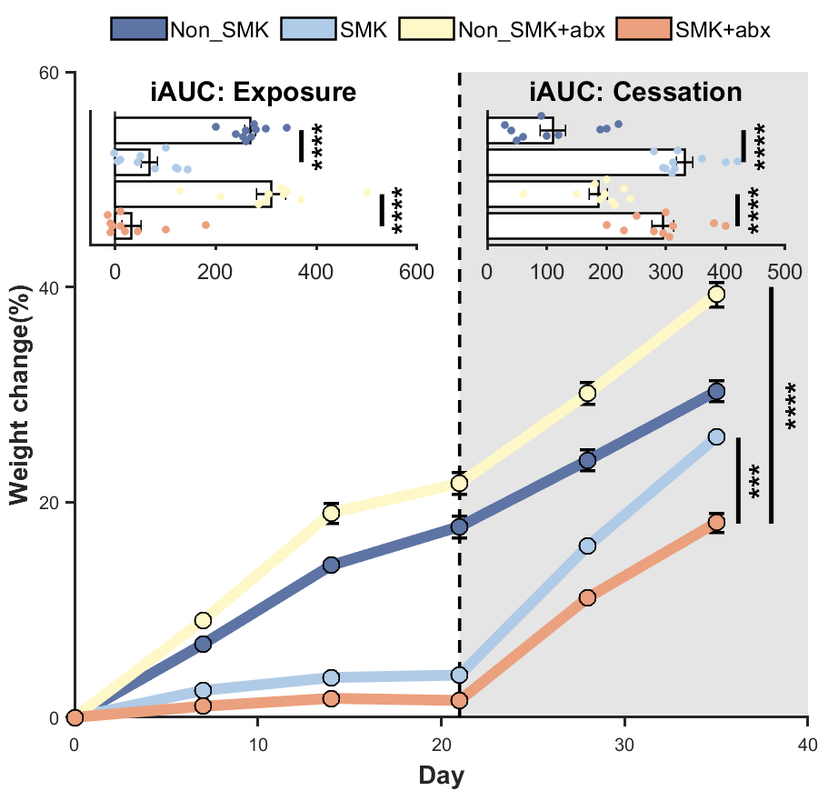
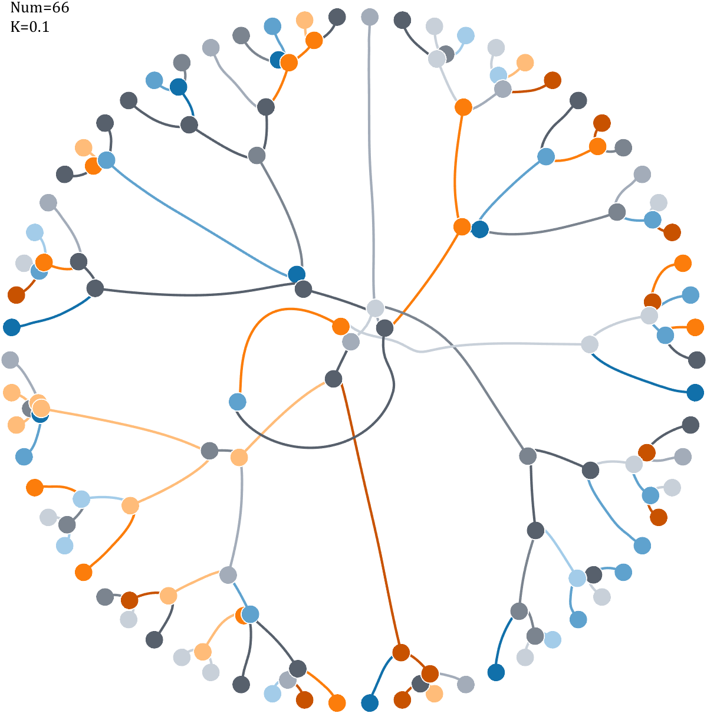
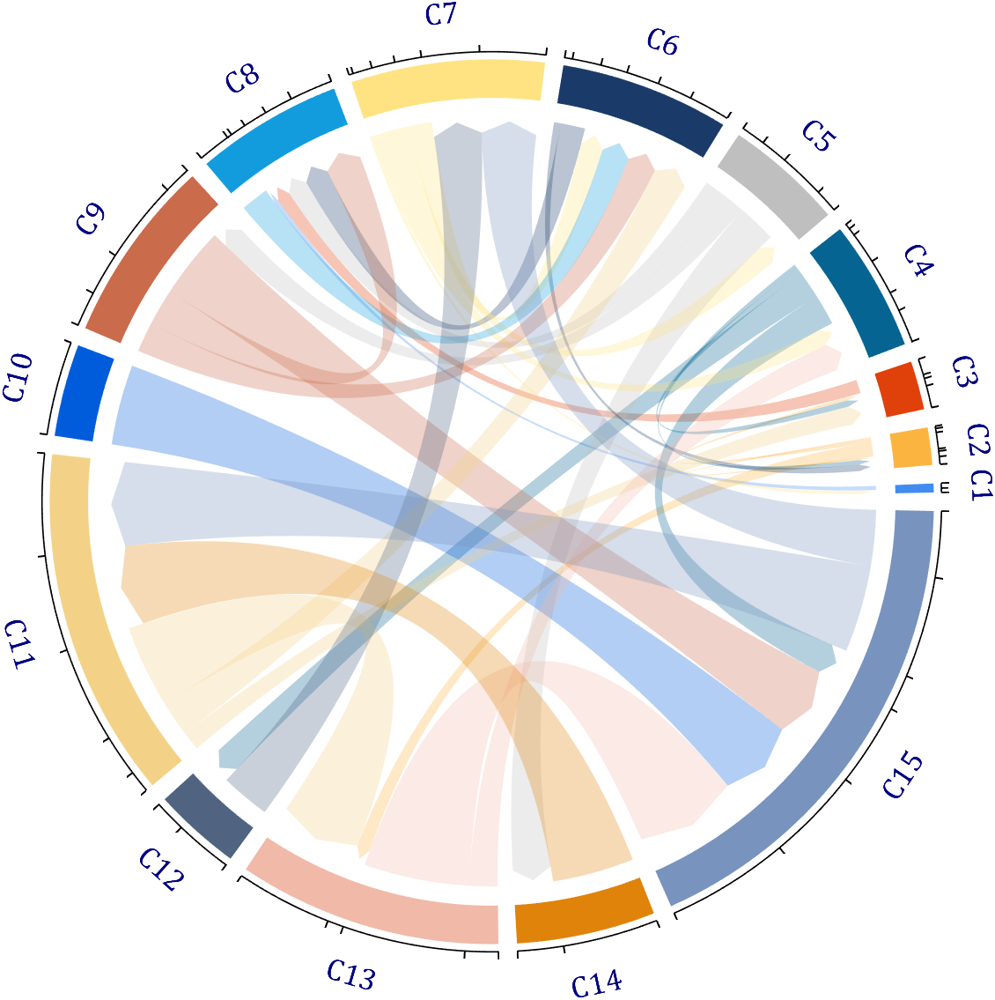
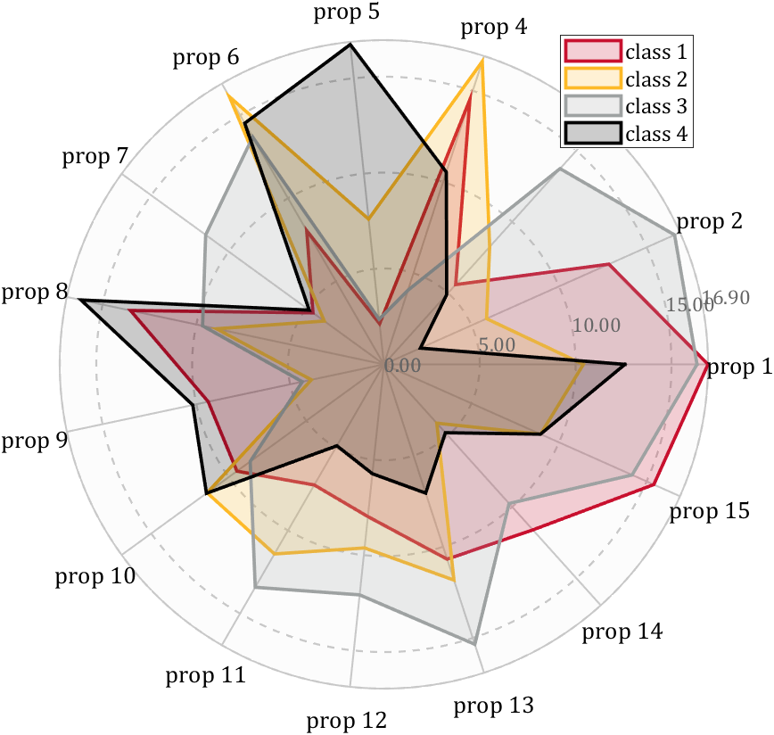
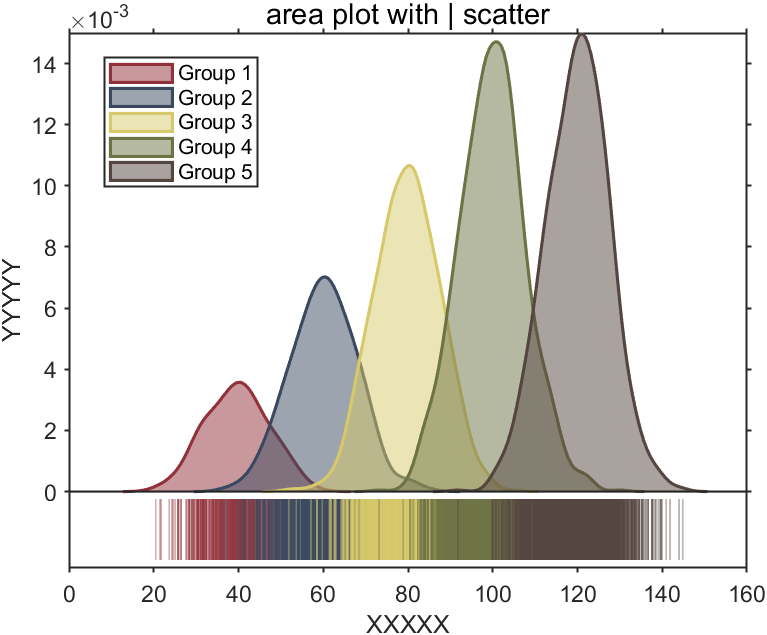